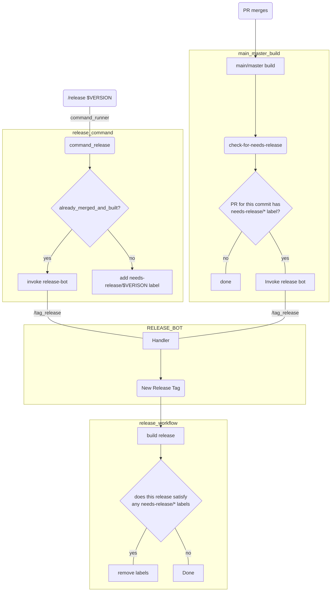

[](https://github.com/pulumi/action-release-by-pr-label/actions/workflows/verify.yml)

# Release by PR Label
GitHub actions to facilitate marking PRs as needing release using labels
and then triggering releases from those labels at a later point.

1. Use 'should-release' command to mark a PR (with a label) as needing release
2. Use 'release-if-needed' after doing the work to verify a commit is ok to begin release (eg. at end of main/master build)
3. Use 'clean-up-release-labels' after a release build to remove labels from the PRs that were released

The advantages of this workflow are:
1. You can fully automate release after a PR is merged
2. What to release and what version number to use is still a human determination
3. needs-release/* labels provide visibility into what PRs are awaiting release, and assist in debugging the release process


## Configuration

### Environment Variables (`env`)

#### `RELEASE_BOT_ENDPOINT` (required)
Create secret to hold the http endpoint for invoking release-bot

    env:
      RELEASE_BOT_ENDPOINT: ${{ secrets.RELEASE_BOT_ENDPOINT }}

#### `RELEASE_BOT_KEY` (required)
Create secret to hold the private key signing requests to release-bot

    env:
      RELEASE_BOT_KEY: ${{ secrets.RELEASE_BOT_KEY }}

#### `GITHUB_TOKEN` (required)
A github token for the user that will be used to add/remove labels

    env:
      GITHUB_TOKEN: ${{ secrets.GITHUB_TOKEN }}

### Input Parameters (`with`)

#### `command` (required)
The command to run. Either "should-release", "release-if-needed", or "clean-up-release-labels"

#### `repo` 
The repository to operate on

    default: ${{ github.repository }}

#### `pr`
The pr to mark for release (only required for "should-release")

#### `version`
The version to release the pr under (only required for "should-release")

#### `commit`
The commit to (possibly) release for "release-if-needed", or that was released for "clean-up-release-labels"

#### `slack_channel`
Optional slack channel for relase-bot to announce on

## Detailed Example
Use peter-evans/slash-command-dispatch to trigger a workflow when a trusted user comments 
with "/release <VERSION>"
```
name: command-dispatch
jobs:
  command-dispatch-for-testing:
    name: command-dispatch-for-testing
    runs-on: ubuntu-latest
    steps:
    - name: Checkout Repo
      uses: actions/checkout@v3
    - uses: peter-evans/slash-command-dispatch@v2
      with:
        commands: |
          release
        issue-type: pull-request
        permission: write
        reaction-token: ${{ secrets.GITHUB_TOKEN }}
        repository: pulumi/pulumi-temp-test-provider
        token: ${{ secrets.PULUMI_BOT_TOKEN }}
on:
  issue_comment:
    types:
    - created
    - edited
```

In the release_command workflow triggered by the slash command, use the 'should-release' command 
from this action to set the correct "needs-release/<VERSION>" label (or immediately tag if the PR
is already merged and built)

```
name: release-command
on:
  repository_dispatch:
    types:
    - release-command
jobs:
  should_release:
    name: Should release PR
    runs-on: ubuntu-latest
    steps:
    - name: Should release PR
      uses: pulumi/action-release-by-pr-label@main
      with:
        command: "should-release"
        repo: ${{ github.repository }}
        pr: ${{ github.event.client_payload.pull_request.number }}
        version: ${{ github.event.client_payload.slash_command.args.all }}
        slack_channel: ${{ secrets.RELEASE_OPS_STAGING_SLACK_CHANNEL }}
      env:
        RELEASE_BOT_ENDPOINT: ${{ secrets.RELEASE_BOT_ENDPOINT }}
        RELEASE_BOT_KEY: ${{ secrets.RELEASE_BOT_KEY }}
        GITHUB_TOKEN: ${{ secrets.GITHUB_TOKEN }}
```

In your default branch build, use this action's 'release-if-needed' command to invoke release bot
to tag the build when there is a needs-release/* label attached to the PR for the commit that was just built
```
jobs:
  ...
  check_for_needs_release:
    name: check for needs-release
    needs: final_default_branch_built_or_test_job
    runs-on: ubuntu-latest
    steps:
    - name: check if this commit needs release
      uses: pulumi/action-release-by-pr-label@main
      with:
        command: "release-if-needed"
        repo: ${{ github.repository }}
        commit: ${{ github.sha }}
        slack_channel: ${{ secrets.RELEASE_OPS_STAGING_SLACK_CHANNEL }}
      env:
        RELEASE_BOT_ENDPOINT: ${{ secrets.RELEASE_BOT_ENDPOINT }}
        RELEASE_BOT_KEY: ${{ secrets.RELEASE_BOT_KEY }}
        GITHUB_TOKEN: ${{ secrets.GITHUB_TOKEN }}
name: main
on:
  push:
    branches:
    - main
```

Finally use this action's clean-up-release-labels at the end of your release job to remove
the needs-release/* labels for any PRs that were released.

```
jobs:
  ...
  clear_need_release_labels:
    name: Clean up release labels
    needs: final_release_step
    runs-on: ubuntu-latest
    steps:
    - name: Clean up release labels
      uses: pulumi/action-release-by-pr-label@main
      with:
        command: "clean-up-release-labels"
        repo: ${{ github.repository }}
        commit: ${{ github.sha }}
      env:
        GITHUB_TOKEN: ${{ secrets.GITHUB_TOKEN }}

name: release
on:
  push:
    tags:
    - v*.*.*
    - "!v*.*.*-**"
```



